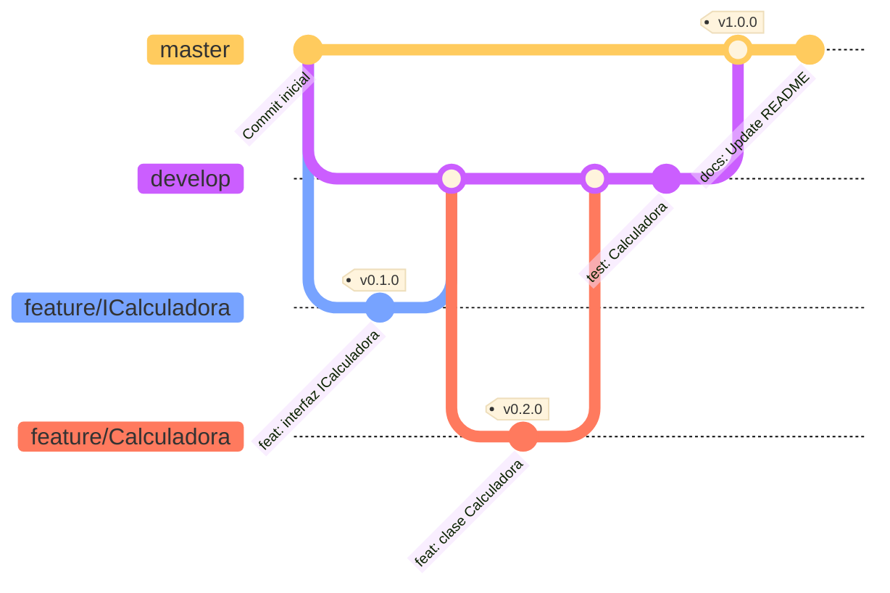

# Practica 5: Test en java  
## Introducción  
En este trabajo veremos como crear un repositorio en GitHub, un proyecto en IntelliJ de Java con Maven y como crear una simple interfaz, la cual documentamos con javadoc, además de una clase que implemente dicha interfaz con sus tests para comprobar que funcione correctamente.  
## Creación del repo y proyecto  
Antes de empezar a escribir código crearemos el repositorio con nombre "Practica5" a través de GitHub.  
  
  

> Imagen 1
> 
> Página de creación de un repositorio en GitHub.


> Imagen 2
>
> Página del repositorio creado, listo para su uso.

Esta página la dejaremos abierta para copiar la URL del repo.  
  
Después crearemos un nuevo proyecto de Java con IntelliJ, en este caso hemos realizado el proyecto con Maven.  
  
  
  
> Imagen 3 
>  
> Configuración que tendrá el proyecto.  
> El nombre del proyecto será `Practica5`, se utilizará `Java 17` y la arquitectura de Maven `quickstart`. Además, cambiaremos el GroupId a `edu.poniperro` y estableceremos que la versión de la que partirá el proyecto sea la `0.0.0`.  
  
Una vez configurado con lo descrito le daremos a `Create`. Una ventana del IDE se abrirá con la carpeta del proyecto y todos los archivos que permiten tener una aplicación funcional de Java con Maven.  
  
  
  
> Imagen 4  
>  
> Estructura principal del proyecto, donde se puede ver:  
> - La carpeta `.idea`, donde se encuentra la configuración del IDE.  
> - La carpeta `src`, en la cual están las carpetas de `main` y `test`.  
> - El archivo `pom.xml`, donde está toda la configuración de Maven.  
  
Ahora entraremos en la terminal, la cual estará ubicada en la raíz del proyecto, para poder usar el control de versiones. Para ello utilizaremos el comando:  
```bash  
$ git init
```  
  
  
  
> Imagen 5  
>  
> Ejecución del comando descrito.
  
A continuación añadiremos el repositorio que hemos creado anteriormente, copiaremos la URL HTTP o SSH, dependiendo de nuestra preferencia, y utilizaremos el siguiente comando:  
```bash  
$ git remote add origin git@github.com:MatiasAGomezJ/Practica5.git
```  


> Imagen 6  
>  
> Ejecución del comando descrito. Un poco modificado debido a mi configuración.  
  
Para comprobar que el comando ha funcionado correctamente utilizaremos la siguiente orden, que nos mostrará el repositorio remoto al que está apuntando:  
```bash  
$ git remote -v
```  

  

> Imagen 7
>
> Ejecución del comando descrito.

Para acabar subiremos todos los archivos al repo, aunque antes crearemos el archivo `README.md`, donde está la información que estás leyendo, y moveremos el archivo `.gitignore` a la raíz del proyecto. Además, añadiremos una nueva línea en la que excluiremos la carpeta `target` e `.idea`.  
  
  

> Imagen 8  
>  
> Muestra los archivos `README.md` y `.gitignore` en la raíz del proyecto junto a la información que hay dentro del segundo.  
  
Con esto ya hecho podremos subir los archivos al repositorio con los siguientes comandos.  
  
```bash  
$ git add .
$ git commit -m "Commit inicial"
$ git push -u origin master
```  
  

  
> Imagen 9  
>  
> Ejecución de los comandos.


También asignaremos una tag al commit y lo subiremos al repositorio.
```bash  
$ git tag v0.0.0
$ git push --tags
``` 


 
> Imagen 10
>  
> Ejecución de los comandos.


 
> Imagen 11
>  
> Página del repo mostrando las tags.

Crearemos una nueva rama llamada `develop` en la cual realizaremos los nuevos cambios. Esta rama se generará a partir del estado de la rama `master`. Nos moveremos a ella y la subiremos al repositorio.
```bash
$ git branch develop
$ git checkout develop
$ git push -u origin develop
```


> Imagen 12
> 
> Ejecución de los comandos.


> Imagen 13
> 
> Página del repo mostrando las ramas que existen.

## Crear la interfaz ICalculadora
Empezaremos creando la rama `feature/ICalculadora` a partir de la rama develop y entraremos en ella con los siguientes comandos:
```bash
$ git branch feature/ICalculadora
$ git checkout feature/ICalculadora
```


> Imagen 14
> 
> Ejecución de los comandos.

Después crearemos el archivo. Lo tendremos que hacer dentro de la carpeta `src/main/java/edu/poniperro`, aunque las últimas dos carpetas no tienen que tener el mismo nombre. Allí crearemos un archivo llamado `ICalculadora.java` o, en el caso de IntelliJ, simplemente `ICalculadora`.


> Imagen 15
> 
> Estructura del proyecto mostrando el archivo creado.

Dentro, además de indicar que es una interfaz, tendremos que declarar los métodos `sumar`, `restar`, `multiplicar` y `dividir`. Todos ellos requerirán de dos parámetros de tipo `double` y devolverán el mismo tipo.

```java
package edu.poniperro;

public interface ICalculadora {

    /**
     * Devuelve la suma de los dos argumentos.
     * @param sumandoA primer valor
     * @param sumandoB segundo valor
     * @return el resultado de la suma
     */
    double sumar(double sumandoA, double sumandoB);

    /**
     * Devuelve la diferencia de los dos argumentos.
     * @param minuendo primer valor
     * @param sustraendo segundo valor a restar del primero
     * @return el resultado de la resta
     */
    double restar(double minuendo, double sustraendo);

    /**
     * Devuelve el producto de los dos argumentos.
     * @param factorA primer valor
     * @param factorB segundo valor
     * @return el resultado de la multiplicación
     */
    double multiplicar(double factorA, double factorB);

    /**
     * Devuelve el cociente de los dos argumentos.
     * @param dividendo primer valor
     * @param divisor segundo valor a dividir del primero
     * @return el resultado de la división
     */
    double dividir(double dividendo, double divisor);
}
```


> Imagen 16
>
> Código de la interfaz.

Con el código ya creado, haremos un commit para guardar los cambios en la rama.
```bash
$ git add .
$ git commit -m "feat: crear interfaz ICalculadora"
```


> Imagen 17
>
> Ejecución de los comandos.

Además, crearemos una nueva tag en la cual incrementaremos la versión actual del proyecto.

```bash
$ git tag v0.1.0
```


> Imagen 18
>
> Ejecución del comando.

Finalmente, fusionaremos la rama en develop, no sin antes entrar en esta:
```bash
$ git checkout develop
$ git merge feature/ICalculadora
```


> Imagen 19
>
> Ejecución de los comandos.

## Crear la clase Calculadora
Al igual que en el punto anterior, empezaremos creando una rama llamada `feature/Calculadora`.
```bash
$ git branch feature/Calculadora
$ git checkout feature/Calculadora
```


> Imagen 20
>
> Ejecución de los comandos.

Después crearemos un archivo llamado `Calculadora` dentro de la misma carpeta que la interfaz. 


> Imagen 21
> 
> Carpeta donde está la clase.

Dentro estará la clase `Calculadora`, la cual dependerá de `ICalculadora`. Aquí estarán implementados todos los métodos de la interfaz.

```java
package edu.poniperro;

/**
 * Almacena operaciones básicas de una calculadora
 */
public class Calculadora implements ICalculadora{

    @Override
    public double sumar(double sumandoA, double sumandoB) {
        return sumandoA + sumandoB;
    }

    @Override
    public double restar(double minuendo, double sustraendo) {
        return minuendo + sustraendo;
    }

    @Override
    public double multiplicar(double factorA, double factorB) {
        return factorA * factorB;
    }

    /**
     * @throws ArithmeticException si el divisor es 0
     */
    @Override
    public double dividir(double dividendo, double divisor) throws ArithmeticException {
        if (divisor == 0) throw new ArithmeticException();
        return dividendo / divisor;
    }
}

```

En el método dividir añadiremos una condición para comprobar que el divisor no sea 0 y, si lo fuera, que devuelva una excepción.


> Imagen 22
> 
> Código de la clase.

Al acabar actualizaremos la rama.
```bash
$ git add .
$ git commit -m "feat: crear clase Calculadora"
```


> Imagen 23
> 
> Ejecución de los comandos.

Incrementaremos la versión.
```bash
$ git tag v0.2.0
```


> Imagen 24
> 
> Ejecución del comando.

Y fusionaremos la rama en develop.
```bash
$ git checkout develop
$ git merge feature/ICalculadora
```


> Imagen 25
> 
> Ejecución de los comandos.
## Crear tests
Ahora procederemos a crear los tests, que utilizarán JUnit4, el cual viene configurado por defecto con Maven. Estos deberán estar situados al mismo nivel que el componente que testean, es decir, en `src/test/java/edu/poniperro`.


> Imagen 26
>
> Estructura del proyecto.

En el archivo tendremos la clase principal `CalculadoraTest` y tendremos un test por cada método de la clase `Calculadora`. Lo primero que haremos será declarar una `Calculadora` que después inicializaremos dentro de una función con un decorador `@BeforeClass`. Esta función, de nombre `setup`, se ejecutará antes de todos los tests permitiéndoles usar este objeto `Calculadora`. Cada test irá precedido del decorador `@Test` y empleará el método `assertEquals`, que compara dos valores, siendo del primero el esperado y el segundo el valor que devolverá la función. En este caso tendrá un tercer parámetro que será el margen de error. 

```java
package edu.poniperro;

import org.junit.BeforeClass;
import org.junit.Test;

import static junit.framework.TestCase.assertEquals;

public class CalculadoraTest {

    static Calculadora calculadora;

    @BeforeClass
    public static void setup() {
        calculadora = new Calculadora();
    }

    @Test
    public void sumarTest() {
        assertEquals(10.0, calculadora.sumar(4.0, 6.0), 0.01);
    }

    @Test
    public void restarTest() {
        assertEquals(-8.0, calculadora.restar(2.0, 10.0), 0.01);
    }

    @Test
    public void multiplicarTest() {
        assertEquals(27.0, calculadora.multiplicar(9.0, 3.0), 0.01);
    }

    @Test
    public void dividirTest() {
        assertEquals(3.0, calculadora.dividir(6.0, 2.0), 0.01);
    }
}
```


> Imagen 27
>
> Código de los tests.

Con los tests terminados comprobaremos que funcionen correctamente. Para ello tenemos dos maneras.

La primera consiste en utilizar las herramientas del propio IDE, el cual nos permite ejecutar los tests de manera sencilla con los botones que aparecen al lado de ellos.


> Imagen 28
>
> Ejecución de los tests a través del IDE.
	
La segunda hace uso del comando `mvn test`, que ejecutará todos los tests que hay en el proyecto.


> Imagen 29
>
> Output del comando por consola.

Una vez comprobado los tests, actualizaremos la rama develop.
```bash
$ git add .
$ git commit -m "test: tests clase Calculadora"
```


> Imagen 30
>
> Ejecución de los comandos.

## Desenlace
Finalmente, subiremos los cambios al repositorio y actualizaremos su versión.
```bash
$ git push
$ git checkout master
$ git merge develop
$ git push
```


> Imagen 31
>
> Ejecución de los comandos.

```bash
$ git tag v1.0.0
$ git push --tags
```


> Imagen 32
>
> Ejecución de los comandos.

Para comprobar el porcentaje de código que utilizan los test hemos hecho uso de la herramienta que nos proporciona IntelliJ. Al hacer clic derecho sobre la carpeta de los tests podremos seleccionar una opción que generará un reporte sobre el porcentaje de líneas recorridas basándonos en el total de líneas del código fuente.


> Imagen 33
>
> Opción que utilizamos.

El resultado será, como hemos dicho antes, el porcentaje de líneas utilizadas.


> Imagen 34
>
> Componentes junto a su cobertura.

Y para finalizar, el diagrama.

